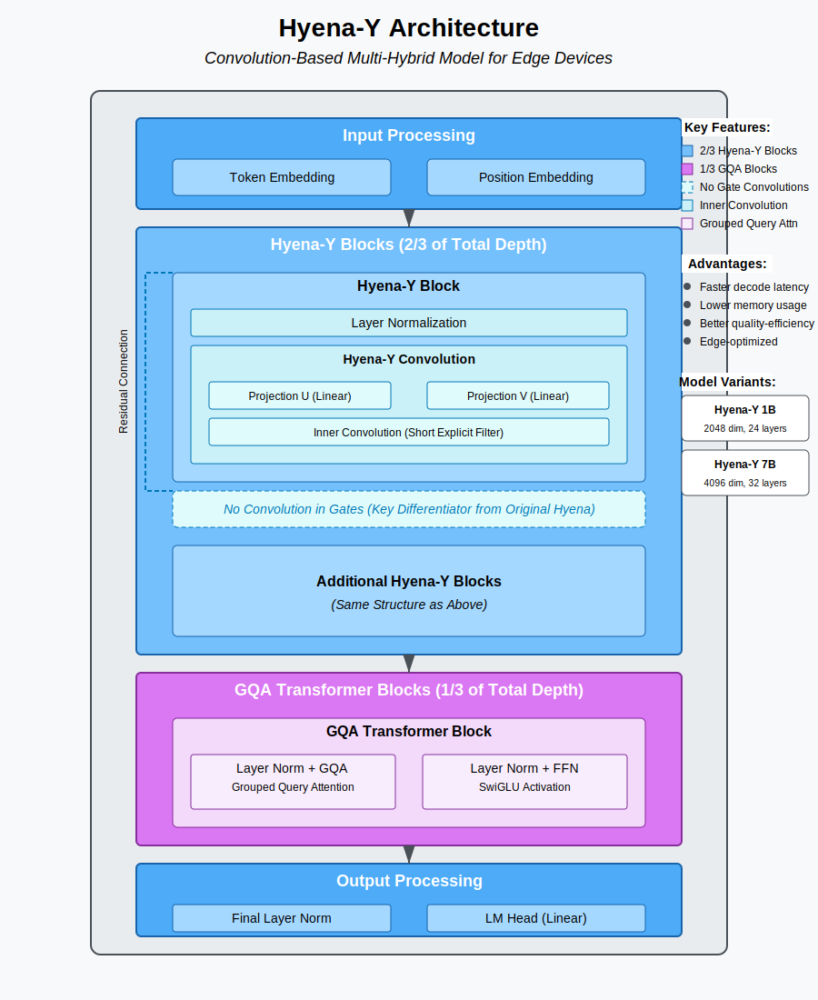

# Hyena-Y

[](https://opensource.org/licenses/MIT)
[](https://www.python.org/downloads/)
[](https://pytorch.org/get-started/locally/)

A PyTorch implementation of the Hyena-Y model, a convolution-based multi-hybrid architecture optimized for edge devices.

## Overview

Hyena-Y is a variant of the Hyena family that excludes convolutions in the feature groups (gates) while preserving the inner convolution. Combined with GQA Transformer blocks (1/3 of the total layers), it provides superior efficiency-quality trade-offs for edge deployment.

This architecture was introduced in ["Convolutional Multi-Hybrids for Edge Devices"](https://www.liquid.ai/research/convolutional-multi-hybrids-for-edge-devices) by the Liquid AI research team.

## Key Features

- **Optimized for Edge Devices**: Faster inference and lower memory footprint on smartphones, laptops, and other edge hardware
- **Multi-Hybrid Architecture**: 2/3 Hyena-Y blocks and 1/3 GQA Transformer blocks
- **Superior Performance**: Up to 30% faster decode & prefill latencies at longer sequences compared to GQA-Transformer++ baselines
- **Competitive Quality**: Better performance across common language modeling benchmarks

## Architecture



Hyena-Y's key innovation is the removal of convolutions in the feature groups (gates) while preserving the inner convolution. This targeted modification provides better efficiency-quality trade-offs specifically for edge deployment scenarios.

The architecture combines:
- **Hyena-Y Blocks**: Modified convolution blocks (2/3 of total layers)
- **GQA Transformer Blocks**: Transformer blocks with Grouped Query Attention (1/3 of total layers)

## Model Variants

| Model | Parameters | Hidden Dim | Depth | Filter Length | Heads | KV Heads | FFN Dim |
|-------|------------|------------|-------|--------------|-------|----------|---------|
| Hyena-Y 1B | 1 Billion | 2048 | 24 | 32 | 16 | 4 | 5632 |
| Hyena-Y 7B | 7 Billion | 4096 | 32 | 64 | 32 | 8 | 11008 |

## Installation

```bash
# Clone the repository
git clone https://github.com/The-Swarm-Corporation/Hyena-Y.git
cd Hyena-Y

# Install dependencies
pip install -r requirements.txt
```

## Requirements

- Python 3.8+
- PyTorch 2.0+
- loguru
- einops

## Quick Start

### Load a Pretrained Model

```python
import torch
from hyena_y import create_hyena_y_1b

# Create model
model, config = create_hyena_y_1b()

# Load pretrained weights (if available)
model.load_pretrained("path/to/weights.pt")

# Move to device
device = torch.device("cuda" if torch.cuda.is_available() else "cpu")
model = model.to(device)
```

### Text Generation

```python
# Tokenize input (replace with your tokenizer)
input_ids = torch.tensor([[1, 2, 3, 4, 5]], device=device)

# Generate text
generated = model.generate(
    input_ids,
    max_new_tokens=100,
    temperature=0.7,
    top_k=50,
    top_p=0.9,
    do_sample=True,
)

print(generated)
```

### Custom Configuration

```python
from hyena_y import HyenaY, HyenaYConfig

# Create a custom configuration
config = HyenaYConfig(
    vocab_size=32000,
    dim=1024,
    depth=16,
    short_filter_length=32,
    max_seq_len=2048,
    num_heads=16,
    num_kv_heads=4,
    ffn_dim=4096,
    dropout=0.1,
    causal=True,
)

# Create model from configuration
model = HyenaY(
    vocab_size=config.vocab_size,
    dim=config.dim,
    depth=config.depth,
    short_filter_length=config.short_filter_length,
    max_seq_len=config.max_seq_len,
    num_heads=config.num_heads,
    num_kv_heads=config.num_kv_heads,
    ffn_dim=config.ffn_dim,
    dropout=config.dropout,
    causal=config.causal,
)
```

## Benchmarking

```python
from hyena_y import create_hyena_y_1b
from hyena_y_utils import benchmark_latency

# Create model
model, config = create_hyena_y_1b()
model.to("cuda")  # Run on GPU

# Benchmark latency
latency_results = benchmark_latency(
    model=model,
    batch_size=1,
    seq_lengths=[128, 256, 512, 1024, 2048],
    device="cuda",
    warmup_steps=5,
    repeat_steps=20,
)

print(latency_results)
```

## Training

```python
from hyena_y import create_hyena_y_1b
from hyena_y_utils import train_hyena_y, TextDataset
from torch.utils.data import DataLoader

# Create model
model, config = create_hyena_y_1b()

# Prepare dataset
train_dataset = TextDataset(train_data, seq_len=1024)
val_dataset = TextDataset(val_data, seq_len=1024)

train_loader = DataLoader(train_dataset, batch_size=8, shuffle=True)
val_loader = DataLoader(val_dataset, batch_size=8)

# Train model
metrics = train_hyena_y(
    model=model,
    train_loader=train_loader,
    val_loader=val_loader,
    num_epochs=10,
    learning_rate=1e-4,
    weight_decay=0.01,
    warmup_steps=1000,
    gradient_accumulation_steps=4,
    fp16=True,
    checkpoint_dir="checkpoints",
)
```


## Model Architecture Details

### Hyena-Y Block

The Hyena-Y block includes:
1. Layer Normalization
2. Projections (U and V)
3. Inner Convolution (with short filter length)
4. Element-wise Multiplication (no gate convolution)

The key difference from the original Hyena is that Hyena-Y excludes convolutions in the feature groups (gates), which makes it more efficient while maintaining performance.

### GQA Transformer Block

The GQA (Grouped Query Attention) Transformer block includes:
1. Layer Normalization
2. Multi-head Attention with grouped KV heads
3. Layer Normalization
4. Feed-forward Network with SiLU activation

## Citation

If you use this implementation in your research, please cite:

```bibtex
@article{hyenay2025,
  title={Convolutional Multi-Hybrids for Edge Devices},
  author={Thomas, Armin and Massaroli, Stefano and Poli, Michael and Liquid Edge Team},
  journal={Liquid AI Research},
  year={2025},
  url={https://www.liquid.ai/research/convolutional-multi-hybrids-for-edge-devices}
}
```

## License

This project is licensed under the MIT License - see the [LICENSE](LICENSE) file for details.

## Acknowledgments

This implementation is based on the research paper ["Convolutional Multi-Hybrids for Edge Devices"](https://www.liquid.ai/research/convolutional-multi-hybrids-for-edge-devices) by the Liquid AI research team.

## Contact

- GitHub: [The-Swarm-Corporation/Hyena-Y](https://github.com/The-Swarm-Corporation/Hyena-Y)
- Research Paper: [Convolutional Multi-Hybrids for Edge Devices](https://www.liquid.ai/research/convolutional-multi-hybrids-for-edge-devices)
